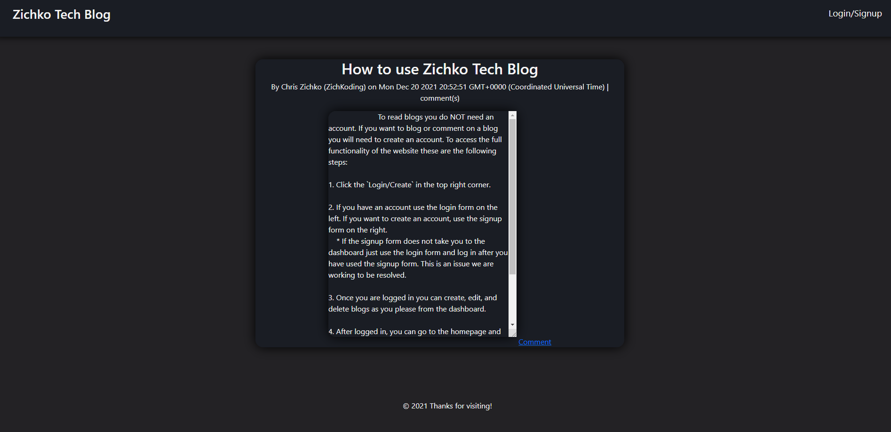

# **ZichkoTechBlog**

[_Click here for live website_](https://zichkotechblog.herokuapp.com)

#

## _Table of Contents_
* [Description](#Description)
* [How to login and signup](#How-to-login-and-signup)
* [How to create a blog](#How-to-create-a-blog)
* [How to edit a blog](#How-to-edit-a-blog)
* [How to delete a blog](#How-to-delete-a-blog)
* [How to comment on a blog](#How-to-comment-on-a-blog)

#
### **Description**

Zichko Tech Blog is a blog site for anyone willing and wanting to share their thoughts and opinions. This can be used to share achievements as well and the process behind those achievements. It is meant to be around coding and technology, but it can be for anything. Check it out and happy blogging!
#

### **How to login and signup**
To login or signup you will need to click the login/signup navigation link in the top right corner of the page in the header.

Once you have reached the login/signup page you can either login by entering your email address and password to in the form under _`Login`_. Once you click submit you will be redirected to your dashboard.

If you are a new user feel free to fill out the form under _`Signup`_. Your username and email must be unique. Your password has be a minimum of four characters long. Once you click submit you will be redirected to your personal dashboard.
#

### **How to create a blog**
After logging in or signing up you be at your dashboard. Your dashboard is where you can create, edit and delete a blog. For now, we will go over how to create a blog. On the dashboard you will see a short, small text area that is for the blog title. Directly below is a much larger text area and that text area is for the main body of the blog. Once those have been filled out you will be able to submit your blog where you will see it to the right underneath _`Your Blogs`_.
#

### **How to edit a blog**
To edit one of your blogs you must be on your dashboard where you will see _`Your Blogs`_ and underneath you will see all of your blogs and click the `Edit Blog` link that corresponds to the blog you would like to edit. 

Once on the `Edit Blog` page you will be able to change the title and/or the contents of the blog. After the blog has been editted, click _`Save Blog`_ under the body of the blog. 
#

### **How to delete a blog**
If you want to delete a blog you will need to navigate back to the `Edit Blog` page. Then click _`Delete Blog`_ underneath _`Save Blog`_. 

***Make sure that you want to delete this blog before clicking delete as there is no way to get it back!***
#

### **How to comment on a blog**
To comment on a blog you will need to be on the homepage where all blogs from all users are displayed. Find a blog that you want to comment on and on the bottom of the body of the blog you will be able to see the _`Comment`_ link, click it. This will take you to the individual blog page, where you can comment and see the comment thread for the individual post.